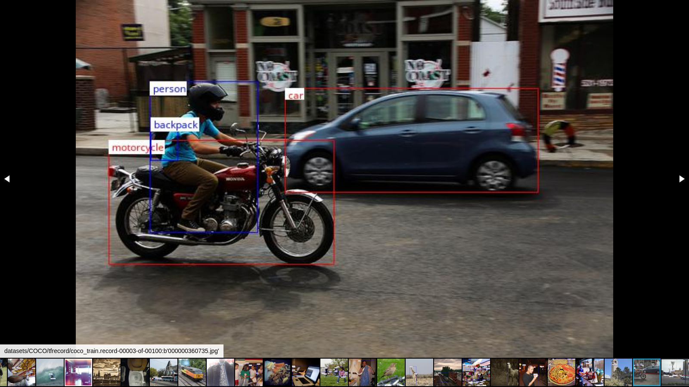
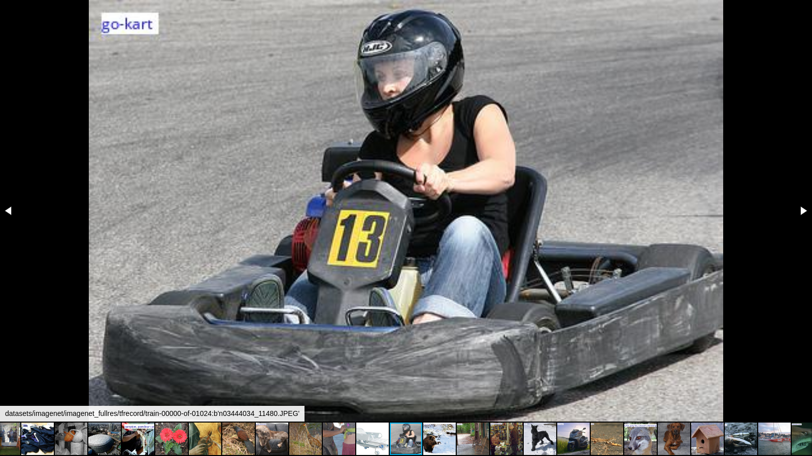
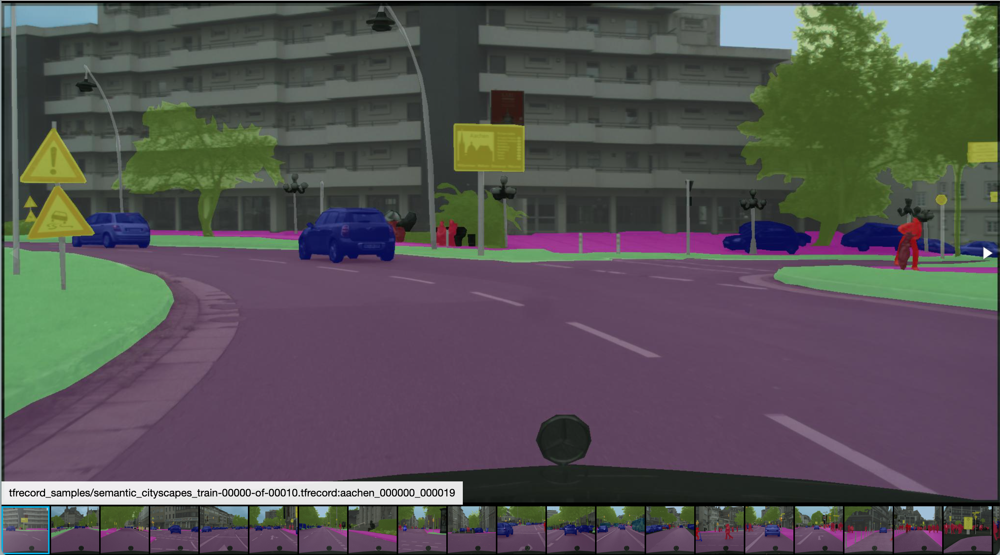

# TFRecord Viewer

"How about checking your data before going deeper?"

Use TFRecord Viewer to browse contents of TFRecords with object detection/classification/segmentation annotations.

The viewer runs a Flask server to provide a web gallery with annotation overlays.
I.e. you can run it on your server machine, but browse on your local machine.

The web gallery displayed with [Fotorama.io](https://fotorama.io/).

# Examples

`python3 tfviewer.py datasets/COCO/tfrecord/coco_train.record-00003-of-00100 --labels-to-highlight='car;truck;bus;motorcycle'`

`python3 tfviewer.py datasets/imagenet/tfrecord/train-00000-of-01024 --overlay classification`

`python3 tfviewer.py tfrecord_samples/semantic_cityscapes_train-00000-of-00010.tfrecord --overlay=segmentation  --segmap-colormap-file=./cityscapes_colormap.txt`
